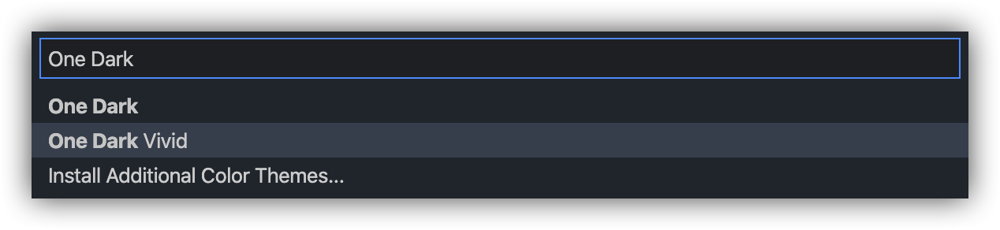

# VS Code One Dark Theme

> [One Dark](https://github.com/atom/one-dark-syntax) theme for VS Code.

## Configuration

This theme comes with several configuration settings to allow you to customize the theme to your preference. We currently support the following settings:

- **Italic** - When enabled, uses italic font for keywords. Note that some scopes \(e.g. markdown block quotes\) are styled with italic font even when this setting is disabled.
- **Bold** - When enabled, uses bold font for namespace, class, and function names. Note that some scopes \(e.g. markdown headers\) are styled with bold font even when this setting is disabled.

To access these configuration settings, open the VS Code settings page and search for "One Dark".

This theme ships with the italic setting turned on by default and the other settings turned off by default, but you can adjust the settings to any combination you like.

## Vivid Variant

In addition to the default color pallette, this theme ships with a vivid variant which uses the [One Dark Vivid](https://atom.io/themes/one-dark-vivid-syntax) pallette. This can be enabled by selecting "One Dark Vivid" from the Color Theme dropdown in your VS Code settings.

## Thanks

- Thanks to [Binaryify](https://github.com/Binaryify) for his work on the theme this project was originally based on.
- Thanks to [VS Code Nebula Theme](https://github.com/eating-coleslaw/vscode-nebula-theme) for the inspiration for creating a configurable color theme.

## Contributors ✨

Thanks goes to these wonderful people ([emoji key](https://allcontributors.org/docs/en/emoji-key)):

<!-- ALL-CONTRIBUTORS-LIST:START - Do not remove or modify this section -->
<!-- prettier-ignore-start -->
<!-- markdownlint-disable -->
<table>
  <tr>
    <td align="center"><a href="https://github.com/mskelton"> <b>Mark Skelton</b></a> <a href="https://github.com/one-dark/vscode-one-dark-theme/commits?author=mskelton" title="Code">💻</a> <a href="#question-mskelton" title="Answering Questions">💬</a> <a href="https://github.com/one-dark/vscode-one-dark-theme/commits?author=mskelton" title="Documentation">📖</a> <a href="#ideas-mskelton" title="Ideas, Planning, & Feedback">🤔</a> <a href="#design-mskelton" title="Design">🎨</a></td>
    <td align="center"><a href="https://github.com/hhquerybuilder"> <b>hhquerybuilder</b></a> <a href="#design-hhquerybuilder" title="Design">🎨</a></td>
  </tr>
</table>

<!-- markdownlint-enable -->
<!-- prettier-ignore-end -->

<!-- ALL-CONTRIBUTORS-LIST:END -->

This project follows the [all-contributors](https://github.com/all-contributors/all-contributors) specification. Contributions of any kind welcome!
